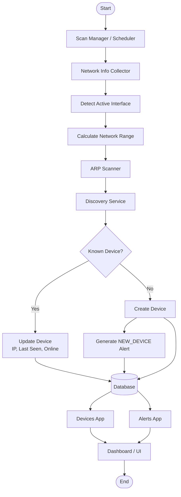

# SentinelLAN
This is a network monitoring tool

## Flowchart

```mermaid
graph TD

    A([Start])

    A --> B[Scan Manager / Scheduler]

    B --> C[Network Info Collector]
    C --> D[Detect Active Interface]
    D --> E[Calculate Network Range]

    E --> F[ARP Scanner]

    F --> G[Discovery Service]

    G --> H{Known Device?}

    H -- Yes --> I[Update Device<br/>IP, Last Seen, Online]

    H -- No --> J[Create Device]

    J --> K[Generate NEW_DEVICE Alert]

    I --> L[(Database)]
    K --> L
    J --> L

    L --> M[Devices App]
    L --> N[Alerts App]

    M --> O[Dashboard / UI]
    N --> O

    O --> P([End])
```
